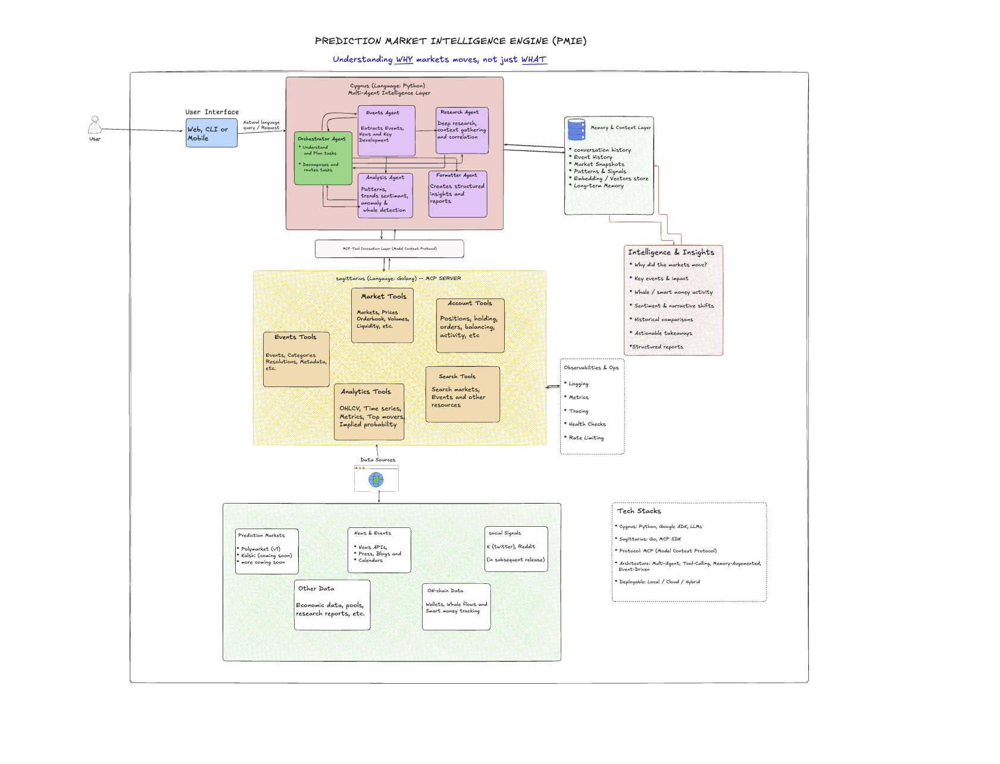

# Cygnus

**Cygnus** is the agentic reasoning layer of the **Prediction Market Intelligence Engine (PMIE)** — a multi-layer system built to answer the one question every price chart leaves unanswered on [Polymarket](https://polymarket.com): ***why did this move?***

Cygnus is built on [Google's Agent Development Kit (ADK)](https://google.github.io/adk-docs/) and orchestrates a small team of specialist Gemini-powered agents that retrieve, interpret, and present prediction-market event data — without ever letting the LLM touch raw, unaggregated trade or order-book data.

> Cygnus is the Python/ADK half of a deliberately **two-repo** architecture: this repository houses Layers 3, 4, and 5, while [Sagittarius](https://github.com/TheGh0xt/Sagittarius) (Go) houses Layers 1 and 2. The MCP connection between them is the only cross-repo seam.

---

## Table of Contents

- [Why This Exists](#why-this-exists)
- [The 5-Layer PMIE Architecture](#the-5-layer-pmie-architecture)
- [Cygnus's Role (Layer 4)](#cygnus-role-layer-4)
- [Agent Architecture](#agent-architecture)
- [Design Rules & Guardrails](#design-rules--guardrails)
- [Output Contract](#output-contract)
- [Project Structure](#project-structure)
- [Getting Started](#getting-started)
- [Environment Variables](#environment-variables)
- [Development Workflow](#development-workflow)
- [Roadmap](#roadmap)

---

## Why This Exists

Prediction markets like Polymarket are decentralized, real-time sentiment aggregators for real-world events ("Will Bitcoin hit $150k by Dec 2026?"). Their prices move constantly, driven by whales, liquidity shifts, and breaking news — but existing dashboards only show *what* happened (a price chart), never *why*.

The naive fix — dumping raw trades and order-book history into an LLM's context window — is slow, expensive, and unreliable:

```
Price Moved ──> Look at Trades ──> Look at Volume ──> Context Dump to LLM ──> Static Explanation
```

PMIE instead separates **deterministic data processing** from **LLM reasoning**, so the LLM only ever reasons over small, pre-aggregated, semantically dense summaries:

```
Price Moved
   │
   ▼
[Layer 1: Sagittarius MCP Server] ──(Raw Data)──> [Layer 2: Signal Engine (Deterministic)]
                                                           │
                                                   (Scored Signals)
                                                           │
                                                           ▼
[Layer 4: Cygnus] <──(Semantic Context)── [Layer 3: Memory Layer (Vector/KV)]
   │
   ├──> Synthesizes causal explanations (structured JSON output)
   │
   ▼
[Layer 5: Evaluation Engine] ──> Continuously tracks & updates historical confidence scores
```

## The 5-Layer PMIE Architecture



| Layer | Name | Status | Responsibility |
|---|---|---|---|
| 1 | **Sagittarius** | Sagittarius repo (Go) — Active | MCP server exposing Polymarket data as protocol-compliant tools. Stateless, zero LLM awareness. |
| 2 | **Signal Engine** | Sagittarius repo (Go) — in-process with Layer 1 | Deterministic anomaly/whale/volume-spike detection over raw market data. No LLM involved; scored signals exposed as MCP tools. |
| 3 | **Memory Layer** | This repo — Planned | Vector/KV store that compresses raw trade history into dense semantic snapshots for token optimization, and retains historical agent explanations. |
| 4 | **Cygnus core** | This repo — In progress | ADK-based reasoning agent orchestration — ingests condensed signals, synthesizes causal explanations, formats output. |
| 5 | **Evaluation Engine** | This repo — Planned | T+48h cron worker that backtests each explanation against actual market outcomes and adjusts confidence weighting. |

Full technical detail on each layer, the token-optimization strategy, and the evaluation feedback loop lives in [`docs/docs_AGENT_SPEC.md`](./docs/docs_AGENT_SPEC.md) and [`docs/docs_PROJECT_PROPOSAL.md`](./docs/docs_PROJECT_PROPOSAL.md).

## Cygnus's Role (Layer 4)

Cygnus is the cognitive layer: it does **not** compute signals or store history itself. It:

1. Receives a request (currently: retrieve a specific Polymarket event).
2. Routes the request to the correct specialist agent.
3. Lets that specialist call out to the **Sagittarius MCP server** for real data.
4. Hands the raw structured result to a formatter agent for clean, human-readable presentation.

As the Memory Layer (Layer 3), Signal Engine (Layer 2), and Evaluation Engine (Layer 5) come online, Cygnus will expand into full causal reasoning — matching scored signals against historical parallels and external news to produce a `MarketAnalysisReport` (see [Output Contract](#output-contract)).

## Agent Architecture

Cygnus is currently a **sequential** orchestration of five ADK `LlmAgent`s (all on `gemini-2.5-flash`):

```
orchestrator  (polymarket_orchestrator)
├── market_event_agent    — retrieves a single Polymarket event via Sagittarius MCP tools
├── market_signal_agent   — retrieves deterministic signals (whale activity, market snapshot)
├── market_analyst_agent  — synthesizes a schema-validated MarketAnalysisReport
└── formatter_agent       — formats structured output for readability only
```

| Agent | File | Prompt | Responsibility |
|---|---|---|---|
| `orchestrator` | `src/agents/orchestrator.py` | `src/prompts/orchestrator.py` | Understands user intent and delegates to the correct specialist. Never analyzes or summarizes data itself. |
| `market_event_agent` | `src/agents/events.py` | `src/prompts/events.py` | Chooses between the `get_event_by_id` and `get_event_by_slug` MCP tools, retrieves exactly one event, and returns the raw tool result untouched. |
| `market_signal_agent` | `src/agents/signals.py` | `src/prompts/signals.py` | Calls `get_market_snapshot` (default) and `get_whale_activity` (whale-specific requests) for an event slug; returns tool results untouched. |
| `market_analyst_agent` | `src/agents/analyst.py` | `src/prompts/analyst.py` | Pure reasoning over the event + signal outputs in session state; emits a `MarketAnalysisReport` enforced via ADK `output_schema` (no tools allowed). |
| `formatter_agent` | `src/agents/formatter.py` | `src/prompts/formatter.py` | Presents the retrieved data in a clean, readable report. Never fabricates, infers, or alters values. |

> **Note:** The orchestrator currently uses ADK's sequential sub-agent model rather than a graph/workflow agent. There's a `TODO` in `src/agents/orchestrator.py` to migrate to a graph-based workflow as routing complexity grows (e.g. once the Memory Layer and Signal Engine are wired in).

### Entry Point

`agent.py` at the repo root exposes:

```python
root_agent = orchestrator
```

ADK auto-discovers `root_agent` because the package's `__init__.py` imports `agent`. This is the standard ADK package convention and is required for `adk web` / `adk run` to find the agent.

### Sagittarius MCP Connection

`market_event_agent` connects to the **Sagittarius** MCP server over StreamableHTTP, configured via the `SAGITTARIUS_MCP_URL` environment variable (default `http://localhost:8080/mcp`). **Sagittarius must be running** before the event agent can retrieve any data.

Tools currently exposed by Sagittarius and used by Cygnus:

- `get_event_by_id` — fetch an event by its numeric Polymarket event ID.
- `get_event_by_slug` — fetch an event by slug, or a slug extracted from a full Polymarket URL (e.g. `https://polymarket.com/events/fed-decision-in-october` → `fed-decision-in-october`).

## Design Rules & Guardrails

These constraints are enforced directly in each agent's system prompt (not just convention):

- **The orchestrator never analyzes.** It only understands intent and routes to specialists.
- **The event agent never speculates.** It retrieves exactly one event using exactly one tool and returns the raw tool result — no summarization, no analysis, no predictions.
- **The formatter never invents or infers.** It presents data for readability only; it never changes numeric values or fills in missing fields.
- **Raw trade/order-book data must never reach the LLM directly.** Aggregation is the Memory Layer's job (Layer 3) — Cygnus only ever reasons over pre-processed, semantically dense context once that layer exists.
- **`master` is protected.** All changes go through pull requests — enforced locally by the `pre-push` git hook in `scripts/hooks/pre-push`.

## Layers 3 & 5: Memory Store and Evaluation Worker

- **`src/memory/`** — Layer 3 MVP: `SqliteMemoryStore` persists every `MarketAnalysisReport` together with the market price observed at report time. SQLite keeps the MVP infrastructure-free; `schema.sql` stays portable for the planned pgvector-backed store, and vector search is deliberately deferred until historical-parallel matching lands. All writes happen in Cygnus — the MCP boundary to Sagittarius remains the only cross-repo seam.
- **`src/evaluation/`** — Layer 5: the T+48h backtesting worker. `evaluate_report` implements the deterministic verification matrix (price held or extended → `CONFIRMED`, confidence +0.05 capped at 1.0; reversed beyond a 0.02 tolerance → `REVERSED`, confidence −0.10 floored at 0.0), and `run_evaluation_cycle` applies it to every due report, skipping markets whose current price can't be fetched. Run it on a cron cadence with:

```bash
.venv/bin/python -m src.evaluation.worker --db pmie_memory.db
```

## Testing

```bash
.venv/bin/pip install -r requirements-dev.txt
.venv/bin/python -m pytest tests/ -v
```

Tests never call Gemini or the network — they validate agent wiring invariants, the output contract, the memory store, and the evaluation matrix.

## Output Contract

Cygnus's analyst agent emits output conforming to the `MarketAnalysisReport` JSON schema defined in [`docs/docs_AGENT_SPEC.md`](./docs/docs_AGENT_SPEC.md), enforced at runtime via ADK's `output_schema` and defined in `src/schemas/report.py`. At a glance:

```json
{
  "market_id": "string",
  "timestamp": "date-time",
  "summary": "string (≤ 500 chars)",
  "primary_causal_driver": "WHALE_ACTIVITY | VOLUME_SPIKE | LIQUIDITY_CRUNCH | EXTERNAL_NEWS | UNKNOWN_ANOMALY",
  "confidence_score": "number (0.0–1.0)",
  "key_drivers": [
    { "type": "string", "impact": "HIGH | MEDIUM | LOW", "evidence_summary": "string" }
  ],
  "historical_context_match": {
    "previous_market_id": "string",
    "prior_explanation_accuracy": "number"
  }
}
```

This contract, together with the token-optimized Memory Layer strategy and the T+48h evaluation feedback loop, is fully documented in the agent spec.

## Project Structure

```
Cygnus/
├── agent.py                    # ADK entry point — exposes root_agent
├── __init__.py                 # imports agent.py so ADK can discover root_agent
├── src/
│   ├── agents/
│   │   ├── orchestrator.py     # polymarket_orchestrator — routes to specialists
│   │   ├── events.py           # market_event_agent — MCP-backed event retrieval
│   │   └── formatter.py        # formatter_agent — presentation only
│   └── prompts/
│       ├── system.py           # shared/base system prompt
│       ├── orchestrator.py     # orchestrator system prompt
│       ├── events.py           # event agent system prompt
│       └── formatter.py        # formatter agent system prompt
├── docs/
│   ├── docs_AGENT_SPEC.md      # reasoning flow, output schema, memory & eval strategy (tracked in git)
│   ├── docs_PROJECT_PROPOSAL.md# full project vision, roadmap, architecture deep-dive
│   └── task.md                 # phase-by-phase implementation checklist
├── scripts/
│   └── hooks/
│       └── pre-push            # blocks direct pushes to master
├── assets/                     # architecture diagrams, etc.
└── CLAUDE.md                   # guidance for AI coding agents working in this repo
```

> `docs/` is gitignored except for `docs_AGENT_SPEC.md`, which is tracked as the canonical technical reference.

## Getting Started

### Prerequisites

- Python **3.14**
- A running **Sagittarius** MCP server (see the Sagittarius repo) — required for the event agent to retrieve real data
- A Google **Gemini API key**

### Setup

```bash
# Create and activate the virtualenv
python3 -m venv .venv
source .venv/bin/activate

# Install dependencies
pip install google-adk google-genai

# Configure environment
cp .env.example .env   # or create .env manually — see Environment Variables below
```

### Running

```bash
# Run the agent in the ADK developer web UI
adk web

# Run the agent interactively in the terminal
adk run Cygnus

# Run with an explicit .env file
adk run --env_file .env Cygnus
```

The ADK dev UI persists conversation state to `.adk/session.db` (gitignored).

## Environment Variables

| Variable | Description |
|---|---|
| `SAGITTARIUS_MCP_URL` | HTTP URL of the Sagittarius MCP server. Defaults to `http://localhost:8080/mcp`. |
| `GOOGLE_API_KEY` | Required by Google ADK for Gemini model access. |

## Development Workflow

- The `master` branch is protected — all work happens on feature branches and lands via pull request.
- Each agent's behavior lives in its system prompt (`src/prompts/`), not in code — prompt changes are the primary way agent behavior evolves.
- When adding a new specialist agent: create `src/agents/<name>.py` + `src/prompts/<name>.py`, then register it in `orchestrator.py`'s `sub_agents` list and update its routing instructions in `src/prompts/orchestrator.py`.

## Roadmap

Cygnus's current scope is intentionally narrow — a two-agent pipeline that can reliably fetch and present one Polymarket event. The full PMIE roadmap (tracked in [`docs/task.md`](./docs/task.md) and [`docs/docs_PROJECT_PROPOSAL.md`](./docs/docs_PROJECT_PROPOSAL.md)) expands this into:

1. **Market Intelligence Core** — Sagittarius MCP server + deterministic Signal Engine for volume/whale anomalies.
2. **News & Narrative Correlation** — cross-reference on-chain anomalies with external news/social feeds.
3. **Memory & Historical Learning** — vector/KV store for token-optimized context and historical pattern matching.
4. **Interactive Analyst Agent** — conversational querying over structured `MarketAnalysisReport` output.
5. **Autonomous Monitoring & Guardrails** — continuous market scraping, alerting, and webhook-based thresholds.

---

*Part of the Prediction Market Intelligence Engine (PMIE) — a system for explaining prediction-market price movement, not just displaying it.*
